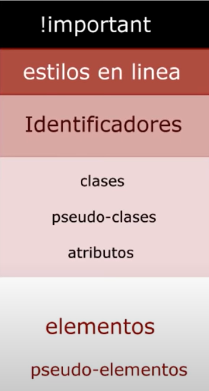

# Teoria de Especificidad

La teoria de especificidad nos dice que cuanto mas arriba este el indicador de estilo mas relevacia y importancia se le tomara al estilo , si se encuentra en un choque de misma jerarquia se usara el estilo en casacada, quiere decir que se tomara importancia al ultimo modificacion del estilo.

* elementos y pseudo-elementos son la primera clase baja

  ```css
  div{
    atributo: propiedad;
  }

  .selector::pseudo-element {
    property: value;
  }
  ```
* el segundo rango de importacia; aca estan las clases, pseudo-clases, atributos.

  ```css
  .miClase{
    propiedad: valor;
  }
  .miclase: focus{
    propiedad: valor;
  }
  [atributo = "valor"]{
    propiedad: valor;
  }
  ```
* depues tenemos a los estilos por id, estos estilos se le asignnan a un unico elemento html.
* casi ya para terminar tenemos los estilo en linea, que se implementan en tl mismo html usando el atributo style = "".
* y por ultimo nivel, el mas poderoso, es el !importan, esta palabra se usa al final de un estilo, le da la maxima importancia,, asi este en el nivel mas bajo.


