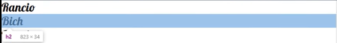
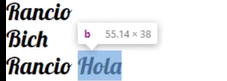

# Teoria de Cajas

Existen 2 tipos de cajas en html, que son :

* Bloque: son las cajas que siempre abarcan todo el ancho de la caja padre.

  ```html
  <h2>Hola</h2>
  ```

  
* inLine: son las cajas que solo abarcan el ancho de su contenido.

  ```html
  <b>Negrita</b>
  ```

  

¿Como hacer que una caja se comporte como uno quiere?

Para poder canbiar el comportamiento de las cajas con 'display'

```css
.miElemento{
	display: inline;
	display: block;
}
```
