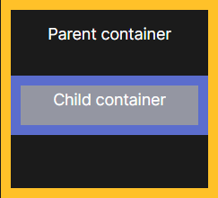

# Box Sizing

Esta propiedad se encarga de calcular el ancho y alto de la caja.

Existen tres valores para la propiedad:

* Content-box:
  Es el comportamiento por defecto que traen las cajas en css, este tipo de calculado usa el ancho + los bordes.

  
* Border-box:
  Este valor le da un comportamiento de adaptacion , que si se define un ancho de 100 px este incluye lkos bordes, paddin, etc.

  
*
