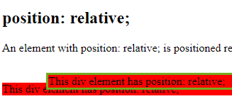
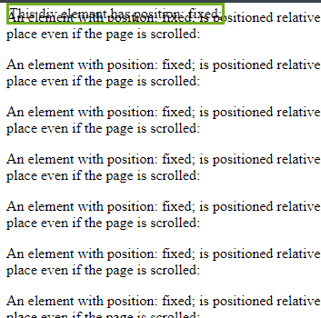

# Position

la propiedad position que se utiliza para saber la posicion de una caja, exiten 5 valores para este propiedad que son :

* static
  Los elementos html por defecto traen la propiedad position static, los elementos estaticos no se ven afectados por las propiedades de top, bottom, left y right.
  Los elementos que posen este valor no estan posicionados de ninguna manera especial; se posicionan de acuerdo con el flujo normal del DOM.

  ```css
  mi-box{
  	position: static;
  }
  ```
* relative

  Los elementos que se posicionan con relacion a su posicion normal, esta valor permite incluir las propiedades de top, bottom, left, right.

  Esta propiedad conserva todas las propiedades de la caja como medidas, border,etc;

  

  Como vemos el segundo div se quedo en su lugar como si el primer div ocupara su espacio, esto es lo que relative nos da, modificar su posicion sin afectar el espacio ocupado.
* fixed

  El valor fixed proporciona a la caja una posicion en la relacion a la ventana grafica, lo que significa que siempre para en el mismo lugar; tambien se pueden usar las propieddes top, bottom, left y right.
  La propiedad fixed eliminar la el espacio que ocupaba, dandole el paso a otro elemento en el flujo del DOM.

  
* absolute:

  El valor absolutese coloca en relacion de la caja padre contenedor, en lugar de posicionarse en relacion con la ventana grafica lo hace con la caja contenedora.
* sticky
